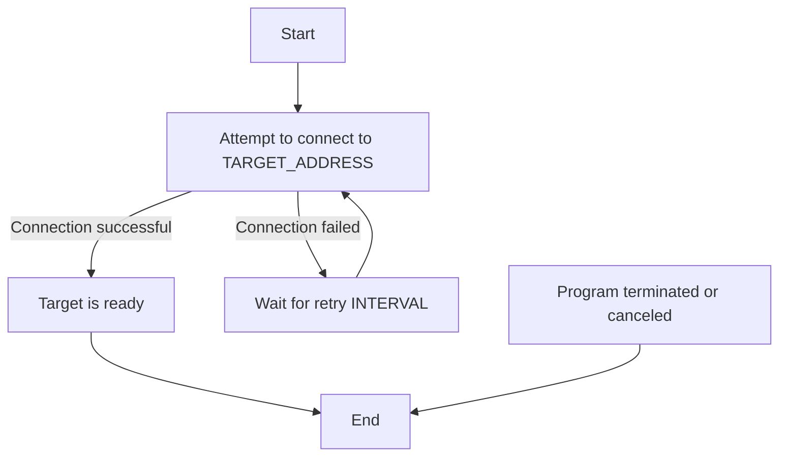

<p align="center">
  
</p>

# TACO (TCP Availability Connection Observer)

This is a simple Go application with zero external dependencies that checks if a specified TCP target is available. It continuously attempts to connect to the specified target at regular intervals until the target becomes available or the program is terminated.

## Environment Variables

The application requires the following environment variables to be set:

- `TARGET_NAME`: The name of the target to check.
- `TARGET_ADDRESS`: The address of the target in the format `host:port`.
- `INTERVAL`: The interval between connection attempts (optional, default: `2s`).
- `DIAL_TIMEOUT`: The timeout for each connection attempt (optional, default: `1s`).
- `LOG_ADDITIONAL_FIELDS`: Log additional fields (optional, default: `false`).

## Behavior Flowchart



## Logging

With the `LOG_ADDITIONAL_FIELDS` environment variable set to `true` additional fields will be logged.

## With additional fields

```

ts=2024-07-05T13:08:20+02:00 level=INFO msg="Waiting for PostgreSQL to become ready..." dial_timeout="1s" interval="2s" target_address="postgres.default.svc.cluster.local:5432" target_name="PostgreSQL" version="0.0.22"
ts=2024-07-05T13:08:21+02:00 level=WARN msg="PostgreSQL is not ready ✗" dial_timeout="1s" error="dial tcp: lookup postgres.default.svc.cluster.local: i/o timeout" interval="2s" target_address="postgres.default.svc.cluster.local:5432" target_name="PostgreSQL" version="0.0.22"
ts=2024-07-05T13:08:24+02:00 level=WARN msg="PostgreSQL is not ready ✗" dial_timeout="1s" error="dial tcp: lookup postgres.default.svc.cluster.local: i/o timeout" interval="2s" target_address="postgres.default.svc.cluster.local:5432" target_name="PostgreSQL" version="0.0.22"
ts=2024-07-05T13:08:27+02:00 level=WARN msg="PostgreSQL is not ready ✗" dial_timeout="1s" error="dial tcp: lookup postgres.default.svc.cluster.local: i/o timeout" interval="2s" target_address="postgres.default.svc.cluster.local:5432" target_name="PostgreSQL" version="0.0.22"
ts=2024-07-05T13:08:27+02:00 level=INFO msg="PostgreSQL is ready ✓" dial_timeout="1s" error="dial tcp: lookup postgres.default.svc.cluster.local: i/o timeout" interval="2s" target_address="postgres.default.svc.cluster.local:5432" target_name="PostgreSQL" version="0.0.22"

```

## Without additional fields

```

time=2024-07-12T12:44:41.494Z level=INFO msg="Waiting for PostgreSQL to become ready..."
time=2024-07-12T12:44:41.512Z level=WARN msg="PostgreSQL is not ready ✗"
time=2024-07-12T12:44:43.532Z level=WARN msg="PostgreSQL is not ready ✗"
time=2024-07-12T12:44:45.552Z level=INFO msg="PostgreSQL is ready ✓"

```

## Kubernetes initContainer Configuration

Configure your Kubernetes deployment to use this init container:

```yaml
initContainers:
  - name: wait-for-valkey
    image: ghcr.io/containeroo/taco:latest
    env:
      - name: TARGET_NAME
        value: valkey
      - name: TARGET_ADDRESS
        value: valkey.default.svc.cluster.local:6379
      - name: INTERVAL
        value: "2s" # Specify the interval duration, e.g., 2 seconds
      - name: DIAL_TIMEOUT
        value: "2s" # Specify the dial timeout duration, e.g., 2 seconds
      - name: LOG_ADDITIONAL_FIELDS
        value: "true"
  - name: wait-for-postgres
    image: ghcr.io/containeroo/taco:latest
    env:
      - name: TARGET_NAME
        value: PostgreSQL
      - name: TARGET_ADDRESS
        value: postgres.default.svc.cluster.local:5432
      - name: INTERVAL
        value: "2s" # Specify the interval duration, e.g., 2 seconds
      - name: DIAL_TIMEOUT
        value: "2s" # Specify the dial timeout duration, e.g., 2 seconds
      - name: LOG_ADDITIONAL_FIELDS
        value: "true"
```
